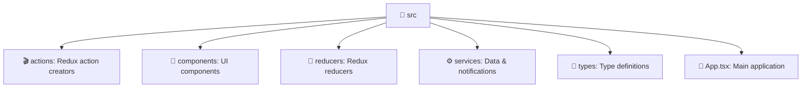

# 🎯 JobFlow – Job Application Tracker

---

## 📖 Overview
**JobFlow** is a React and TypeScript web app for tracking job applications.  
It uses **Redux** for state management, **Firebase Firestore** for persistence, **Tailwind CSS** for styling, and **Vite** for development.  

✨ Features include **offline access**, **real-time synchronization**, and **browser notifications**.

---

## ✨ Features
- 📌 **Manage job applications** – add, update, and delete applications with statuses (`applied`, `interview`, `offer`, `_rejected_`).
- 🔄 **Redux actions & reducers** – centralized state updates for CRUD.
- 🔐 **User authentication** – login/logout states and error handling.
- ☁️ **Firebase integration with offline fallback** – reads/writes to Firestore, queues offline actions, and persists locally.
- 🔔 **Notification system** – requests FCM permission, listens for messages, schedules reminders.
- 🖥 **Core UI logic** – loads applications, sets notifications, filters/searches, and handles CRUD.

---

## 📂 Project Structure (Diagram)

---

## 📜 Scripts

| Command | Description |
|---------|-------------|
| ▶️ **`npm run dev`**     | Starts the **Vite** development server for local testing |
| 🛠 **`npm run build`**   | Runs **TypeScript type-checking** and builds the app for production |
| 🧹 **`npm run lint`**    | Executes **ESLint** on all `.ts` and `.tsx` files to ensure code quality |
| 👀 **`npm run preview`** | Previews the built app locally using Vite’s preview server |

---

## 🚀 Live Demo  

👉 [**Explore JobFlow Live**](https://anassabbou.github.io/JobFlow/)  

---

## 📜 License

This project is licensed under the MIT License – see the LICENSE file for details.
