# 🎯 JobFlow – Job Application Tracker

---

## 📖 Overview
**JobFlow** is a React and TypeScript web app for tracking job applications.  
It uses **Redux** for state management, **Firebase Firestore** for persistence, **Tailwind CSS** for styling, and **Vite** for development.  

✨ Features include **offline access**, **real-time synchronization**, and **browser notifications**.

---

## ✨ Features
- 📌 **Manage job applications** – add, update, and delete applications with statuses (`applied`, `interview`, `offer`, `_rejected_`).
- 🔄 **Redux actions & reducers** – centralized state updates for CRUD.
- 🔐 **User authentication** – login/logout states and error handling.
- ☁️ **Firebase integration with offline fallback** – reads/writes to Firestore, queues offline actions, and persists locally.
- 🔔 **Notification system** – requests FCM permission, listens for messages, schedules reminders.
- 🖥 **Core UI logic** – loads applications, sets notifications, filters/searches, and handles CRUD.

---

## 📂 Project Structure (Diagram)

```mermaid
graph TD
    A[📂 src]
    A --> B[🎬 actions: Redux action creators]
    A --> C[🧩 components: UI components]
    A --> D[🔄 reducers: Redux reducers]
    A --> E[⚙️ services: Data & notifications]
    A --> F[📝 types: Type definitions]
    A --> G[🚪 App.tsx: Main application]

```

---

## 📜 Scripts

| Command | Description |
|---------|-------------|
| ▶️ **`npm run dev`**     | Starts the **Vite** development server for local testing |
| 🛠 **`npm run build`**   | Runs **TypeScript type-checking** and builds the app for production |
| 🧹 **`npm run lint`**    | Executes **ESLint** on all `.ts` and `.tsx` files to ensure code quality |
| 👀 **`npm run preview`** | Previews the built app locally using Vite’s preview server |

---

## 🚀 Live Demo  

👉 [**Explore JobFlow Live**](https://anassabbou.github.io/JobFlow/)  

---

## 🧩 Browser Extension

The `extension/` directory contains a minimal Chrome extension that can
auto-fill job application forms using data stored in the JobFlow web app.

### How it works

- When visiting the JobFlow app (`localhost:5173` during development or the
  hosted demo), the extension syncs your saved applications from
  `localStorage` into extension storage.
- On other websites, the extension attempts to populate common job
  application fields (position, company, location, description) with the first
  stored application.

### Installation

1. Open **chrome://extensions** in Chrome.
2. Enable **Developer mode**.
3. Choose **Load unpacked** and select the `extension` folder from this
   repository.

---

## 📜 License

This project is licensed under the MIT License – see the [LICENSE](./LICENSE) file for details.
